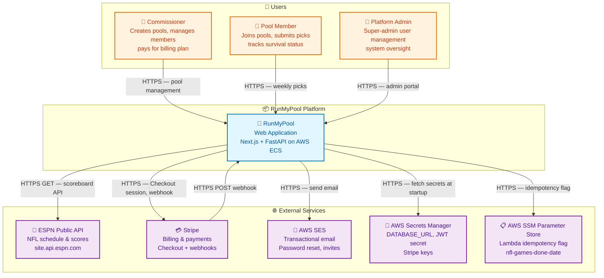
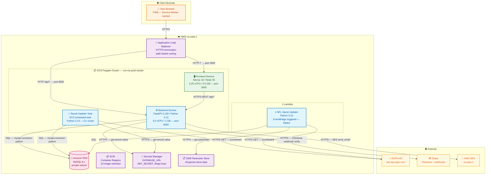
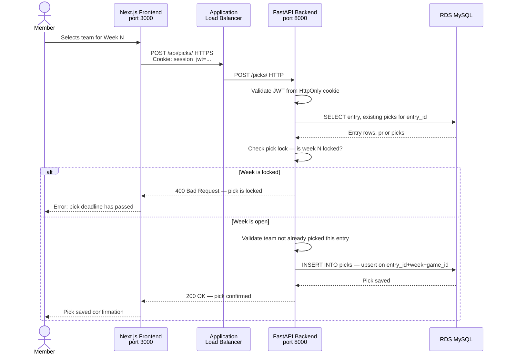
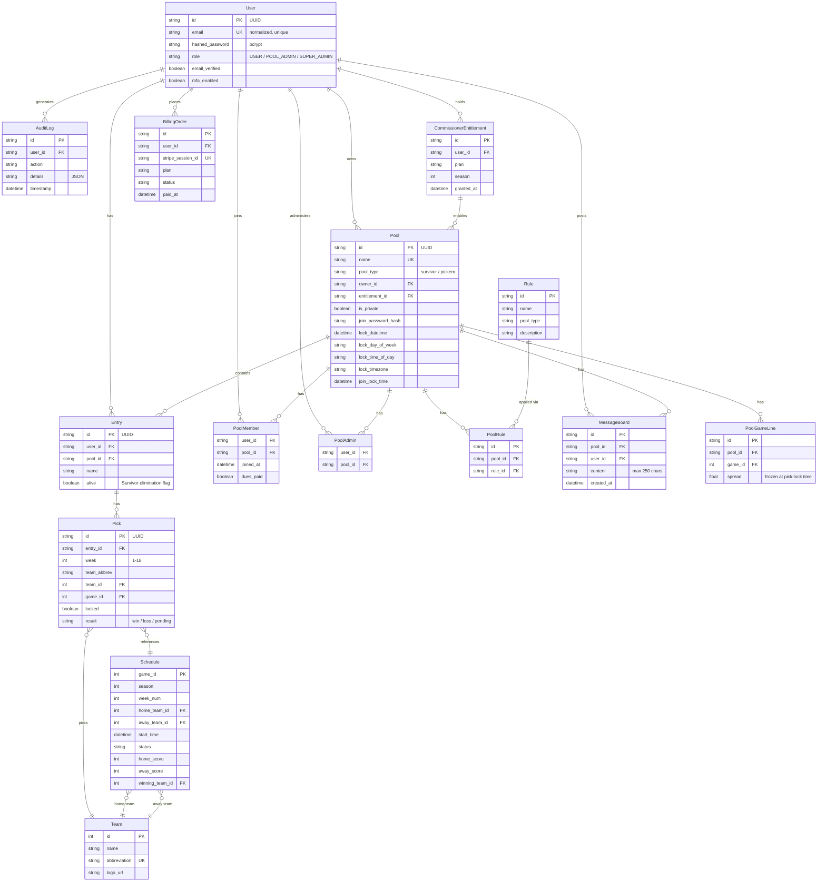
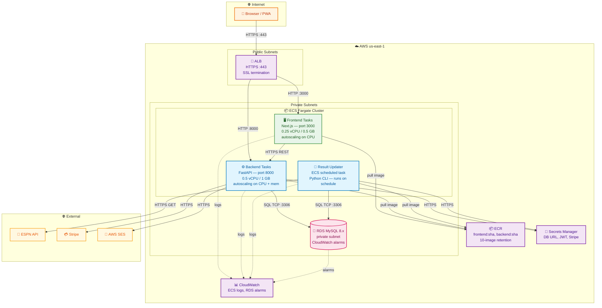

# RunMyPool — Architecture Brief

## Table of Contents

- [Overview](#overview)
- [Problem Definitions & Business Context](#problem-definitions--business-context)
- [C4 System Context Diagram](#c4-system-context-diagram)
- [System Overview](#system-overview)
  - [C4 Container Diagram](#c4-container-diagram)
  - [C4 Container Diagram Explanation](#c4-container-diagram-explanation)
  - [Request Flow Sequence](#request-flow-sequence)
  - [Technology Stack](#technology-stack)
- [System Data Models](#system-data-models)
  - [Data Model ER Diagram](#data-model-er-diagram)
  - [Data Model Explanation](#data-model-explanation)
- [API Endpoints](#api-endpoints)
  - [Auth](#auth--auth)
  - [Users](#users--users)
  - [Pools](#pools--pools)
  - [Entries](#entries--entries)
  - [Picks](#picks--picks)
  - [Admin](#admin)
  - [Schedule & Teams](#schedule--teams)
  - [Billing](#billing--billing)
  - [Message Board](#message-board--message-board)
  - [Audit & Analytics](#audit--analytics)
  - [Platform Admin](#platform-admin--platform-admin)
  - [Health](#health)
- [Deployment Architecture](#deployment-architecture)
- [Document Metadata](#document-metadata)

## Overview

RunMyPool (`runmypool.net`) is a SaaS sports pool management platform for the NFL season. Commissioners create and manage football pools — starting with Survivor format — while members join, make weekly picks, and compete across an 18-week season. The platform handles pick lock enforcement, automated result ingestion from ESPN, billing via Stripe, and transactional email via AWS SES, all deployed on AWS ECS Fargate behind an Application Load Balancer.

## Problem Definitions & Business Context

> **This section is the foundation of the architecture brief.** It grounds all subsequent technical decisions by establishing _why_ the system exists and _what_ problems it solves.

### Problem Statement

Football pool management has historically been manual — spreadsheets, group texts, and honor-system tracking. This creates:

- **No enforcement of pick lock deadlines** — late picks accepted informally
- **No automated result processing** — someone manually updates standings after each game week
- **No scalable entry management** — commissioners with dozens of entries struggle to track eliminations and dues
- **No audit trail** — disputes about who picked what and when are unresolvable

RunMyPool replaces this with an automated platform: picks lock on schedule, ESPN results are ingested automatically, standings update without manual intervention, and every action is logged.

### Business Context

- **Primary Users**: NFL pool commissioners (who pay for the platform) and pool members (who join free)
- **Use Cases**:
  - Create a Survivor pool and invite members
  - Members create entries and submit weekly team picks before the lock deadline
  - System auto-picks for members who miss the deadline
  - Results ingested from ESPN after game completion; surviving entries advance, losing entries are eliminated
  - Commissioner manages dues, admin overrides, and pool configuration
- **Non-Functional Requirements**:
  - Availability: deployed on ECS Fargate with autoscaling; ALB health checks; RDS with CloudWatch alarms
  - Security: bcrypt passwords, JWT HttpOnly cookies, rate-limited login, one-time-use reset tokens, security headers via ASGI middleware
  - Scalability: connection pooling, ECS autoscaling on CPU/memory
  - Auditability: every action written to `audit_logs` table
- **Integration Points**: ESPN public API (NFL schedule/scores), Stripe (billing), AWS SES (transactional email), AWS Secrets Manager (secrets injection), AWS SSM Parameter Store (Lambda idempotency)
- **Monetization**: Four Stripe billing tiers gate pool creation capacity:

  | Plan | Max Entries | Max Pools |
  |---|---|---|
  | Commissioner | 50 | 1 |
  | Pro | 150 | 1 |
  | Club | 500 | 5 |
  | Club Unlimited | Unlimited | Unlimited |

## C4 System Context Diagram

## System Overview

### C4 Container Diagram

### C4 Container Diagram Explanation

The platform is a standard three-tier web application deployed on AWS ECS Fargate.

**ALB** terminates HTTPS and routes traffic by path: API calls (`/api/*`) go to the FastAPI backend on port 8000; all other paths go to the Next.js frontend on port 3000.

**Frontend** (`Next.js 16 / React 19`) renders server-side and client-side pages. It is packaged as a PWA with a Workbox-based service worker for offline capability. The frontend makes authenticated REST calls to the backend using the JWT stored in an HttpOnly cookie.

**Backend** (`FastAPI / Python 3.13`) is the sole application server. It handles authentication (JWT, bcrypt), business logic (pool management, pick locking, entitlement gating), and all database writes. A background async task (`_weekly_lock_worker`) polls every 60 seconds to enforce pick lock schedules. The backend uses SQLAlchemy + mysql-connector-python to talk to RDS.

**Result Updater** is an ECS-scheduled task (and legacy Lambda) that fetches NFL game results from the ESPN public API and reconciles pick outcomes and Survivor eliminations in the database. The ECS task uses a MySQL advisory lock for safe concurrent execution. The Lambda variant is in transition to retirement.

**RDS (MySQL 8.x)** is the single data store for all application state. It lives in a private subnet, accessible only from within the VPC.

**Secrets Manager** injects `DATABASE_URL`, `JWT_SECRET`, and Stripe API keys into ECS task environments at startup — never baked into images.

#### Request Flow Sequence

The most critical flow is a member submitting a weekly pick before the lock deadline.

### Technology Stack

**Runtime & Languages:**

- Python 3.13 — backend and result updater
- Node.js 20 — frontend build and runtime
- Next.js 16.3.0 — frontend framework (SSR + SSG)
- React 19.2.8 — frontend UI library
- FastAPI 0.139.2 — backend REST framework (ASGI)
- Pydantic v2 (2.13.4) — request/response validation and serialization
- SQLAlchemy — ORM (async-compatible sessions)
- Alembic 1.16.5 — database migrations

**Data Storage:**

- Amazon RDS MySQL 8.x — primary application database (production)
- SQLite (in-memory) — test database

**Infrastructure:**

- AWS ECS Fargate — container runtime for frontend, backend, result updater
- AWS Application Load Balancer — HTTPS termination, path-based routing
- AWS Lambda — legacy NFL result updater (EventBridge triggered)
- AWS ECR — container image registry (10-image retention policy)
- Terraform — infrastructure as code (ECS, ALB, RDS alarms, SES, Lambda)
- GitHub Actions — CI/CD pipelines for backend, frontend, Lambda

**Monitoring & Security:**

- AWS CloudWatch — ECS and RDS logs, RDS alarms
- bcrypt via passlib — password hashing
- PyJWT — JWT HS256 token issuance (24-hour expiry)
- ASGI security middleware — CSP, HSTS, X-Frame-Options, X-Content-Type-Options, Referrer-Policy, Permissions-Policy
- Codecov — backend test coverage reporting

## System Data Models

### Data Model ER Diagram

### Data Model Explanation

The data model is organized around five core entities:

**User** is the root identity. A user can own pools (Commissioner role), join pools as a member, or hold super-admin privileges. Passwords are bcrypt-hashed and never stored in plaintext (a known bug exists in one admin endpoint).

**Pool** represents a football pool. Its `pool_type` determines the game format (`survivor` or `pickem`). Pools have configurable pick lock schedules — either a fixed `lock_datetime` or a recurring `lock_day_of_week` + `lock_time_of_day` + `lock_timezone`. A pool is gated by a `CommissionerEntitlement` that limits how many pools and entries the owner can create.

**Entry** is a user's participation slot in a pool. A user may have multiple entries. In Survivor format, `alive=False` marks elimination. Entries lock at the pool-level `join_lock_time`, preventing new entries mid-season.

**Pick** is a single weekly team selection within an entry. The unique constraint on `(entry_id, week, game_id)` prevents duplicate picks. The `result` field is updated by the result updater after ESPN confirms game outcomes. `locked=True` prevents further changes.

**Schedule** / **Team** provide the NFL data layer. `Schedule` rows are imported from ESPN and indexed heavily for query performance (by season+week, by team, by start_time). `PoolGameLine` freezes point spreads at pick-lock time for future Pick'em scoring support.

**Supporting entities:**
- `PoolMember` / `PoolAdmin` — join tables for membership and admin assignment
- `AuditLog` — append-only action log with JSON `details` for every significant operation
- `CommissionerEntitlement` + `BillingOrder` — Stripe billing lifecycle; entitlements are the governing record for pool creation limits
- `MessageBoard` — pool-scoped chat with 250-char limit and rate limiting enforced at the API layer
- `UpdaterRun` — durable execution record for the ECS result updater to prevent duplicate processing
- `StripeWebhookEvent` — idempotency guard for Stripe webhook replay
- `UsedPasswordResetToken` — SHA-256 digests of consumed tokens for one-time-use enforcement
- `LoginAttempt` — rate-limiting table; cleared on successful login

## API Endpoints

### Auth — `/auth`

**Public API Endpoints:**

| Method | Path | Description |
|---|---|---|
| `POST` | `/auth/register` | Create account — bcrypt hash, email normalization, audit log |
| `POST` | `/auth/login` | Authenticate — returns JWT as HttpOnly Secure SameSite=Lax cookie; rate-limited 5 attempts / 15 min per email |
| `POST` | `/auth/logout` | Clear session cookie |
| `GET` | `/auth/me` | Return current authenticated user |
| `POST` | `/auth/forgot-password` | Send SES password reset email (opaque response — no user enumeration) |
| `POST` | `/auth/reset-password` | Token-validated password reset; token consumed via SHA-256 digest |

### Users — `/users`

**Internal API Endpoints:**

| Method | Path | Description |
|---|---|---|
| `GET` | `/users/` | List users — **known gap: publicly accessible, user enumeration risk** |
| `GET` | `/users/{id}` | Get user by ID |
| `DELETE` | `/users/{id}` | Delete user |
| `PATCH` | `/users/{id}/email` | Update user email |
| `PATCH` | `/users/{id}/password` | Admin password reset — **known bug: stores plaintext** |

### Pools — `/pools`

**Public API Endpoints:**

| Method | Path | Description |
|---|---|---|
| `POST` | `/pools/` | Create pool (Commissioner role; entitlement-gated) |
| `GET` | `/pools/` | Get current user's pools |
| `GET` | `/pools/{id}` | Get pool by ID |
| `PATCH` | `/pools/{id}` | Update pool settings (owner or admin) |
| `DELETE` | `/pools/{id}` | Delete pool (owner only) |
| `POST` | `/pools/{id}/join` | Join pool — optional password for private pools |
| `POST` | `/pools/{id}/invite` | Send SES email invite to prospective member |
| `GET` | `/pools/{id}/invite-info` | Get invite preview (public — for invite link landing) |
| `GET` | `/pools/{id}/check-admin` | Check whether current user has admin access |

### Entries — `/entries`

**Public API Endpoints:**

| Method | Path | Description |
|---|---|---|
| `POST` | `/entries/` | Create entry in pool — HTTP 423 if pool join-lock has passed |
| `GET` | `/entries/{id}` | Get entry |
| `PATCH` | `/entries/{id}` | Update entry name |
| `DELETE` | `/entries/{id}` | Delete entry — HTTP 423 if pool join-lock has passed |

### Picks — `/picks`

**Public API Endpoints:**

| Method | Path | Description |
|---|---|---|
| `POST` | `/picks/` | Create or upsert pick for week — HTTP 400 if week is locked |
| `GET` | `/picks/entry/{entry_id}` | Get all picks for an entry |
| `PATCH` | `/picks/{id}` | Update pick — HTTP 400 if pick is locked |
| `DELETE` | `/picks/{id}` | Delete pick — HTTP 400 if pick is locked |

### Admin

**Internal API Endpoints (pool-scoped):**

| Method | Path | Description |
|---|---|---|
| `POST` | `/admin/transfer-entry` | Transfer entry ownership to another user |
| `DELETE` | `/admin/entries/{id}` | Delete any entry in pool |
| `POST` | `/admin/lock-week/{week}` | Lock a week and auto-pick all entries missing a pick |
| `PATCH` | `/admin/picks/{id}` | Override any pick — locked or unlocked |
| `GET` | `/admin/members` | List pool members |
| `PATCH` | `/admin/members/{user_id}/dues` | Update dues paid status |
| `POST` | `/admin/members/{user_id}/lock` | Lock (suspend) a user within a pool |
| `POST` | `/admin/members/{user_id}/unlock` | Unlock a suspended user |
| `GET` | `/admin/user-overview` | League admin user summary |
| `GET` | `/admin/auto-pick-report` | Auto-pick audit report |
| `GET` | `/admin/admins` | List pool admins |
| `PATCH` | `/admin/admins` | Assign or revoke pool admin role |
| `POST` | `/admin/transfer-ownership` | Transfer pool ownership to another user |

### Schedule & Teams

**Public API Endpoints:**

| Method | Path | Description |
|---|---|---|
| `GET` | `/schedule/` | All NFL schedule entries |
| `GET` | `/schedule/week/{week_num}` | Games for a specific week |
| `GET` | `/schedule/teams/{week_num}` | Teams playing in a given week |
| `GET` | `/teams/` | List all NFL teams |
| `GET` | `/rules/` | List available pool rule types |

### Billing — `/billing`

**Public API Endpoints:**

| Method | Path | Description |
|---|---|---|
| `POST` | `/billing/checkout` | Create Stripe Checkout session for a billing plan |
| `POST` | `/billing/webhook` | Stripe webhook handler — idempotent via `StripeWebhookEvent` table |
| `GET` | `/billing/overview` | User's billing history and active entitlement |
| `GET` | `/billing/success` | Post-payment confirmation page data |

### Message Board — `/message-board`

**Public API Endpoints:**

| Method | Path | Description |
|---|---|---|
| `GET` | `/message-board/{pool_id}` | List pool messages — pool members only |
| `POST` | `/message-board/` | Post message — rate-limited 5 posts / 10 min per user per pool; max 250 chars |
| `DELETE` | `/message-board/{id}` | Delete own message |

### Audit & Analytics

**Internal API Endpoints:**

| Method | Path | Description |
|---|---|---|
| `GET` | `/audit/` | Search audit logs — filter by user_id, date range, action text |
| `GET` | `/audit/filter-options` | Available filter values for the audit search UI |
| `POST` | `/analytics/lifecycle` | Record user lifecycle funnel events |

### Platform Admin — `/platform-admin`

**Internal API Endpoints (super-admin only):**

| Method | Path | Description |
|---|---|---|
| `GET` | `/platform-admin/users` | List all users with pool counts |
| `PATCH` | `/platform-admin/users/{id}/lock` | Lock a user account platform-wide |
| `PATCH` | `/platform-admin/users/{id}/role` | Assign or revoke roles |

### Health

**Backend:**

| Method | Path | Description |
|---|---|---|
| `GET` | `/` | Welcome message |
| `GET` | `/health` | `{"status": "healthy"}` — ALB health check target |

**Frontend (Next.js API routes):**

| Method | Path | Description |
|---|---|---|
| `GET` | `/api/health` | `{status: "healthy", service: ..., timestamp: ...}` |
| `GET` | `/api/live` | Liveness probe |
| `GET` | `/api/ready` | Readiness probe |

## Deployment Architecture

All resources deploy to **AWS us-east-1**. VPC, subnets, IAM roles, RDS instance, and ECR repositories are pre-existing; the Terraform in this repo manages ECS cluster, ECS services, ALB configuration, SES, CloudWatch alarms, and the Lambda function.

**CI/CD Pipeline (GitHub Actions):**

| Trigger | Pipeline | Steps |
|---|---|---|
| Push to `rmp/backend/**` | `build-backend.yml` | pytest (SQLite) → MySQL integration tests → Docker smoke test → ECR push → ECS force-deploy |
| Push to `rmp/frontend/**` | `build-frontend.yml` | Jest + lint + build → npm audit → ECR push → ECS force-deploy |
| Push to `lambda/**` | `deploy-lambda.yml` | pytest → pip-audit → Terraform apply |

**Known Technical Debt:**

| Issue | Severity |
|---|---|
| `GET /users/` is publicly accessible — user enumeration risk | High |
| `PATCH /users/{id}/password` stores plaintext password | Critical |
| `user_id: int` type mismatch — User.id is UUID string | Medium |
| No JWT refresh / expiry handling in frontend auth context | Medium |
| Lambda result updater lacks VPC connectivity | Operational |
| Lambda and ECS result updater must not run concurrently | Operational |

---

## Document Metadata

| Field | Value |
|---|---|
| Repository | `run-my-pool` |
| Generated | 2026-08-13 |
| Backend version | FastAPI 0.139.2 / Python 3.13 |
| Frontend version | Next.js 16.3.0 / React 19.2.8 |
| Database | MySQL 8.x (Amazon RDS) |
| Infrastructure | AWS ECS Fargate, us-east-1 |
| Migrations | 15 Alembic revisions |
| Test coverage | 298 backend tests, 64 frontend tests |
